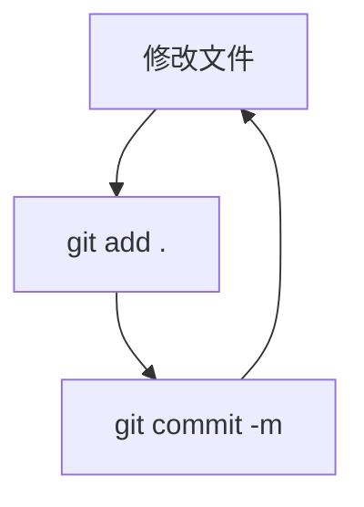

## 一. git 是什么
git 用于文件的**版本控制**，即记录文件的内容变化，从初版到第二版再到终版，每一版都清晰可查
git 分为：
- 集中式：有一个中央服务器，所有人都从那里下载代码（github）
- 分布式：每一台计算机就是一个完成的代码仓库，离线工作

## 二. git 怎么用 (本地)
首先，需要知道 git 的**三个区域**：
- **工作区**：你电脑上能看到的文件夹，也就是你实际修改代码的工作文件夹
- **暂存区**：一个临时存放改动的地方，比方说你可以在完成一个小改动之后把它“暂存”起来，等你完成改动之后，可以一起提交
- **本地仓库**：最终存放所有版本历史的地方，位于 `.git` 文件夹中，一旦提交，记录就永久记录在案

### 1. 初始化
```bash
git config --global user.name "名字"

git config --global user.name "邮箱@example.com"
```
`--global` 表示这台电脑上的所有 git 仓库都用这个配置
### 2. `git init` 初始化仓库
```bash
cd my_project
git init
```
这会在项目文件夹中创建一个 `.git` 文件夹，从此这个项目就由 git 管理了。
### 3. `git status` 查看状态
这是最常用、最重要的命令！它会告诉你当前工作区和暂存区的状态，比如哪些文件被修改了，哪些文件还没被跟踪。**随时随地敲一下 `git status` 是个好习惯。**
### 4. `git add <文件名>` 添加到暂存区
例如，你修改或新建了某文件，需要用 `add` 命令告诉 git，你想要把这个改动进行存档
```bash
git add README.md #添加单个文件到暂存区

git add . #添加所有已修改或新建的文件到暂存区
```
### 5. `git commit -m "提交说明"` 提交到本地仓库
这是存档的最后一步，将暂存区的所有内容生成一个新的版本，并永久保存在 git 中。`-m` 后面跟着的是本次提交的说明，**必须清晰、简洁地描述这次你做了什么**。例如 `"feat: 添加用户登录功能"` 或 `"fix: 修复无法显示图片的bug"`
```bash
git commit -m "Initial commit:添加项目说明文件"
```
### 6. `git log` 查看历史记录
```bash
# 查看详细历史
git log
# 查看简化的历史
git log --oneline
# 查看图形化的分支历史
git log --graph --oneline --all
```

工作流：


---
## 三. git 怎么用（远程仓库）
### 1. `git clone <仓库地址>` 克隆仓库
这是加入一个项目的第一步，把远程仓库的所有内容（包括历史修改记录）下载到本地
```bash
git clone git@github.com:username/repository-name.git
```
### 2. `git remote` 管理远程仓库地址
`clone` 之后，git 会自动把远程仓库命名为 `origin` (这是远程仓库的别名, 以后都用这个名字来称呼远程仓库)
```bash
# 查看已配置的远程仓库
git remote -v

# 如果你是从本地 init 的仓库，需要手动添加一个远程仓库
git remote add origin git@github.com:username/repository-name.git
```
### 3. `git push` 推送本地提交到远程
当你 `commit` 一些改动后，使用 `push` 命令将这些改动提交到远程服务器，这样所有人就都能看到了
```bash
# 将本地的 main 分支推送到 origin 远程仓库
# -u 参数会在推送的同时，将本地的 main 分支与远程的 main 分支关联起来，后续推送可以直接用 git push
git push -u origin main
```
### 4. `git pull` 拉取远程更新
在开始一天新工作之前，先使用 `git pull` 拉取最新更新，以免发生冲突
## 四、分支
举个例子，对于一个项目，它可能有已经开发稳定和可发布的版本 `main`，但是目前我们发现了项目存在 bug，要修复它，则需要在不影响发布版的情况下开出分支进行 hotfix，在修复完毕后才能够和 `main` 合并。此外，可能还会有 `feature-A` 分支用于开发新功能。
这些分支互不影响，在功能完成后再进行合并，使得工作流程更加安全、更加有条理。
**核心命令**：
- `git branch`： 查看本地所有分支，`*` 表示当前分支
- `git branch <分支名>`：创建一个新分支
- `git switch <分支名>`：切换分支
- `git switch -c <分支名>`：创建一个新分支并切换
- `git merge <要合并过来的分支名>`：把指定的分支合并到当前分支
- `git branch -d <分支名>`：删除一个分支
## 五. 版本回退与修改
### 1. 工作区/暂存区撤销
- **`git checkout -- <文件名>` or `git restore <文件名>`**：丢弃工作区的修改（注意：是**丢弃**，修改会**消失**）。
- **`git reset HEAD <文件名>` or `git restore --staged <文件名>`**：将暂存区的修改撤销回工作区（`add` 的反向操作）。
### 2. 版本回退
- **`git reset --hard <commit_id>`**：彻底回退到某个版本。`commit_id` 可以通过 `git log` 查看，通常写前几位即可。**这是一个危险操作**，`--hard` 会丢弃回退点之后的所有提交。
- **`git reflog`**：如果你用 `reset --hard` 回退错了，可以用这个命令看到你所有的操作记录，找到你回退之前的 commit id，再 `reset` 回去。这是你的“后悔药”。
- **`git revert <commit_id>`**：更安全的回退方式。它会创建一个**新的提交**，内容正好是抵消掉你想撤销的那个提交的内容。推荐在团队协作中使用，因为它不会修改公共的历史记录。

## 六. 进阶技能
- **`.gitignore` 文件**：项目中有些文件/文件夹我们不希望被 Git 管理（如编译产物、日志文件、依赖包 `node_modules` 等）。在项目根目录创建一个 `.gitignore` 文件，把这些文件/文件夹的名字写进去即可。
- **`git stash`**：临时保存工作区和暂存区的改动。当你正在一个分支上开发，突然需要切换到另一个分支改 bug，但当前工作又没完成不想提交，就可以用 `git stash` 将当前改动“藏”起来。改完 bug 切回来后，用 `git stash pop` 恢复。
- **`git tag`**：给某一次重要的提交打上一个标签，通常用于版本发布，如 `v1.0.0`。
- **`git cherry-pick <commit_id>`**："摘樱桃"，将某一个分支的某一次提交，单独拿过来应用到当前分支。
### 七. 纠错
- 使用 `git branch -M <分支新名字>` 来为当前分支改名。